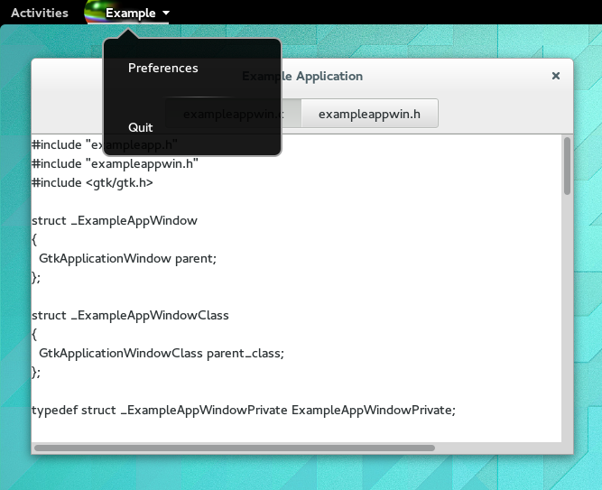
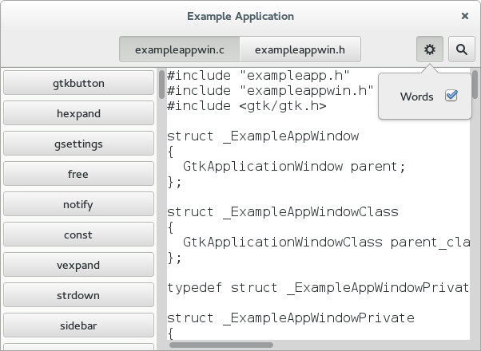
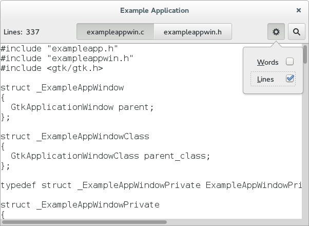

## 构建应用程序


一个普通的应用程序由以下文件组成：

* 二进制文件
>这个安装在 `/usr/bin`。
* 一个桌面文件
>这个桌面文件向shell提供关于这个程序的重要信息,例如名称、图标、D-Bus名称，启动的命令行。安装在 `/usr/share/applications`.
* 一个图标
>这个图标安装在 `/usr/share/icons/hicolor/48x48/apps`, 无论当前背景是什么系统都会到这里查找图标。
* 一个设置框架
>如果应用使用了GSettings, 它会将它的schema安装在 ` /usr/share/glib-2.0/schemas`, 这样dconf-editor之类的工具就能够找到它。
* 其他资源
>其他文件,例如GtkBuilder ui文件, 最好从应用二进制文件自身储存的资源中加载。如果有需要，许多文件会按照惯例放置在`/usr/share`。

GTK+ includes application support that is built on top of GApplication. 在这篇教程中，我们从头开始构建一个简单的应用，然后逐渐一点一点增加功能。在这个过程中, 我们将会了解到 GtkApplication, templates, resources, application menus, settings, GtkHeaderBar, GtkStack, GtkSearchBar, GtkListBox和更多东西。

完整的源文件可以在 GTK+ source distribution的范例根目录下找到，或者可以在GTK+的git仓库在线查看。

###一个小应用
当使用GtkApplication，main主函数非常简单。我们仅仅调用了`g_application_run()` 并给出一个应用范例。

```c
#include <gtk/gtk.h>
#include <exampleapp.h>

int
main (int argc, char *argv[])
{
  return g_application_run (G_APPLICATION (example_app_new ()), argc, argv);
}
```

所有的应用程序逻辑都在GtkApplicaton的子类中。我们的范例还没有任何有趣的功能。它所做的只是当它没有传递参数而被激活时打开一个窗口和传递了参数被激活时打开给定的文件。  

为了处理这两种情况，我们重载了activate()vfunc，当应用程序被加载没有命令行参数时它被调用，当应用程序被加载并带有命令行参数时，调用open()vfunc。

想知道更多关于Gapplication入口知识，请查看GIO文档。

```c
#include <gtk/gtk.h>

#include "exampleapp.h"
#include "exampleappwin.h"

struct _ExampleApp
{
  GtkApplication parent;
};

struct _ExampleAppClass
{
  GtkApplicationClass parent_class;
};

G_DEFINE_TYPE(ExampleApp, example_app, GTK_TYPE_APPLICATION);

static void
example_app_init (ExampleApp *app)
{
}

static void
example_app_activate (GApplication *app)
{
  ExampleAppWindow *win;

  win = example_app_window_new (EXAMPLE_APP (app));
  gtk_window_present (GTK_WINDOW (win));
}

static void
example_app_open (GApplication  *app,
                  GFile        **files,
                  gint           n_files,
                  const gchar   *hint)
{
  GList *windows;
  ExampleAppWindow *win;
  int i;

  windows = gtk_application_get_windows (GTK_APPLICATION (app));
  if (windows)
    win = EXAMPLE_APP_WINDOW (windows->data);
  else
    win = example_app_window_new (EXAMPLE_APP (app));

  for (i = 0; i < n_files; i++)
    example_app_window_open (win, files[i]);

  gtk_window_present (GTK_WINDOW (win));
}

static void
example_app_class_init (ExampleAppClass *class)
{
  G_APPLICATION_CLASS (class)->activate = example_app_activate;
  G_APPLICATION_CLASS (class)->open = example_app_open;
}

ExampleApp *
example_app_new (void)
{
  return g_object_new (EXAMPLE_APP_TYPE,
                       "application-id", "org.gtk.exampleapp",
                       "flags", G_APPLICATION_HANDLES_OPEN,
                       NULL);
}
```

应用程序中另一个受GTK+支持的重要的类是GtkApplicationWindow。它通常也是子类。我们的子类不做任何事，因此我们只得到一个空的窗口。


```c
#include "exampleapp.h"
#include "exampleappwin.h"
#include <gtk/gtk.h>

struct _ExampleAppWindow
{
  GtkApplicationWindow parent;
};

struct _ExampleAppWindowClass
{
  GtkApplicationWindowClass parent_class;
};

G_DEFINE_TYPE(ExampleAppWindow, example_app_window, GTK_TYPE_APPLICATION_WINDOW);

static void
example_app_window_init (ExampleAppWindow *app)
{
}

static void
example_app_window_class_init (ExampleAppWindowClass *class)
{
}

ExampleAppWindow *
example_app_window_new (ExampleApp *app)
{
  return g_object_new (EXAMPLE_APP_WINDOW_TYPE, "application", app, NULL);
}

void
example_app_window_open (ExampleAppWindow *win,
                         GFile            *file)
{
}
```

作为我们应用程序初始化中的一部分，我们创建一个图标和一个桌面文件。


```
[Desktop Entry]
Type=Application
Name=Example
Icon=exampleapp
StartupNotify=true
Exec=@bindir@/exampleapp
```
**注意** @bindir@需要被实际的二进制文件路径替代，这样桌面文件才能使用。

这就是目前我们实现的:


至今我们的程序并没那么瞩目，但是它已经在会话总线上出现，它有单个实例，而且它接受文件作为命令行参数。

### 填充窗口

在这节中，我们用GtkBuilder 模板结合一个GtkBuilder ui 文件和我们的应用程序窗口类。

我们的简易ui 文件把GtkHeaderBar 放在GtkStack 部件顶端。头栏包括一个显示GtkStack 页面分页的一行的独立部件——GtkStackSwitcher。 

```xml
<?xml version="1.0" encoding="UTF-8"?>
<interface>
  <!-- interface-requires gtk+ 3.8 -->
  <template class="ExampleAppWindow" parent="GtkApplicationWindow">
    <property name="title" translatable="yes">Example Application</property>
    <property name="default-width">600</property>
    <property name="default-height">400</property>
    <child>
      <object class="GtkBox" id="content_box">
        <property name="visible">True</property>
        <property name="orientation">vertical</property>
        <child>
          <object class="GtkHeaderBar" id="header">
            <property name="visible">True</property>
            <child type="title">
              <object class="GtkStackSwitcher" id="tabs">
                <property name="visible">True</property>
                <property name="margin">6</property>
                <property name="stack">stack</property>
              </object>
            </child>
          </object>
        </child>
        <child>
          <object class="GtkStack" id="stack">
            <property name="visible">True</property>
          </object>
        </child>
      </object>
    </child>
  </template>
</interface>
```
为了在我们的应用程序中使用这个文件，我们回到我们的GtkApplicationWindow 子类，从类初始化函数中调用gtk_widget_class_set_template_from_resource() 来把ui 文件设为这个类的模板。在实例初始化函数中我们增加gtk_widget_init_template() 去为我们的类的个体实例化模板。

```
 ...

static void
example_app_window_init (ExampleAppWindow *win)
{
  gtk_widget_init_template (GTK_WIDGET (win));
}

static void
example_app_window_class_init (ExampleAppWindowClass *class)
{
  gtk_widget_class_set_template_from_resource (GTK_WIDGET_CLASS (class),
                                               "/org/gtk/exampleapp/window.ui");
}

 ...

 ```

([full source](https://git.gnome.org/browse/gtk+/tree/examples/application2/exampleappwin.c))

你也许注意到了，我们在函数中用了变量_from_resource()来设定一个模板。现在我们需要用GLib的资源功能在二进制文件中包含一个ui file。通常是在.gresource.xml中列出所有资源，就像这样：

```xml
<?xml version="1.0" encoding="UTF-8"?>
<gresources>
  <gresource prefix="/org/gtk/exampleapp">
    <file preprocess="xml-stripblanks">window.ui</file>
  </gresource>
</gresources>
```

这个文件必须被转换成一个C 源文件，这样它才能和其他源文件一起被编译链接进应用程序中。因此，我们使用了`glib-complie-resources`：

```
glib-compile-resources exampleapp.gresource.xml --target=resources.c --generate-source
```

如今我们的应用程序就像这样：


### 打开文件

在这节，我们使我们的应用程序展示命令行传来的文件的正文。

在这后面，我们为我们的应用程序的窗口子类增加了一个私有的结构体，结构体内是一个指向GtkStack的指针。`gtk_widget_class_bind_template_child_private()`函数使得在实例化模板后，私有结构体中的stack成员会指向模板中的同名部件。

```c
...

struct _ExampleAppWindowPrivate
{
  GtkWidget *stack;
};

G_DEFINE_TYPE_WITH_PRIVATE(ExampleAppWindow, example_app_window, GTK_TYPE_APPLICATION_WINDOW);

...

static void
example_app_window_class_init (ExampleAppWindowClass *class)
{
  gtk_widget_class_set_template_from_resource (GTK_WIDGET_CLASS (class),
                                               "/org/gtk/exampleapp/window.ui");
  gtk_widget_class_bind_template_child_private (GTK_WIDGET_CLASS (class), ExampleAppWindow, stack);
}

...
```

([full source](https://git.gnome.org/browse/gtk+/tree/examples/application3/exampleappwin.c))

现在我们重新看一下在每个命令行参数中都会被调用的`example_app_window_open()`函数，然后构建`GtkTextView`，它在后来的stack中作为一页被添加。

```c
...

void
example_app_window_open (ExampleAppWindow *win,
                         GFile            *file)
{
  ExampleAppWindowPrivate *priv;
  gchar *basename;
  GtkWidget *scrolled, *view;
  gchar *contents;
  gsize length;

  priv = example_app_window_get_instance_private (win);
  basename = g_file_get_basename (file);

  scrolled = gtk_scrolled_window_new (NULL, NULL);
  gtk_widget_show (scrolled);
  gtk_widget_set_hexpand (scrolled, TRUE);
  gtk_widget_set_vexpand (scrolled, TRUE);
  view = gtk_text_view_new ();
  gtk_text_view_set_editable (GTK_TEXT_VIEW (view), FALSE);
  gtk_text_view_set_cursor_visible (GTK_TEXT_VIEW (view), FALSE);
  gtk_widget_show (view);
  gtk_container_add (GTK_CONTAINER (scrolled), view);
  gtk_stack_add_titled (GTK_STACK (priv->stack), scrolled, basename, basename);

  if (g_file_load_contents (file, NULL, &contents, &length, NULL, NULL))
    {
      GtkTextBuffer *buffer;

      buffer = gtk_text_view_get_buffer (GTK_TEXT_VIEW (view));
      gtk_text_buffer_set_text (buffer, contents, length);
      g_free (contents);
    }

  g_free (basename);
}

...
```
([full source](https://git.gnome.org/browse/gtk+/tree/examples/application3/exampleappwin.c))

**注意**我们不一定非要接触stack switcher。它从它属于的stack得到了自己所有的信息。在这里，我们传递`gtk_stack_add_titled()`函数的最后一个参数来显示每个文件的标签。

我们的程序打开后就像这样：


### 一个应用菜单

一个应用程序菜单被GNOME shell在屏幕顶端显示。它用来收集影响整个应用程序的常用动作。

就像窗口模板，在一个ui file 中我们指定了我们的应用程序菜单，然后作为资源向二进制文件中添加。

```xml
<?xml version="1.0"?>
<interface>
  <!-- interface-requires gtk+ 3.0 -->
  <menu id="appmenu">
    <section>
      <item>
        <attribute name="label" translatable="yes">_Preferences</attribute>
        <attribute name="action">app.preferences</attribute>
      </item>
    </section>
    <section>
      <item>
        <attribute name="label" translatable="yes">_Quit</attribute>
        <attribute name="action">app.quit</attribute>
      </item>
    </section>
  </menu>
</interface>
```

为了关联应用程序和应用菜单，我们必须调用`gtk_application_set_app_menu()`。y因为应用菜单被活动的GActions激活，所以必须为应用程序增加一个合适的设定。

所有这些任务最好在startup()函数中做完，因为startup()函数被保证在每个应用程序实例中只被调用一次。

```c
...

static void
preferences_activated (GSimpleAction *action,
                       GVariant      *parameter,
                       gpointer       app)
{
}

static void
quit_activated (GSimpleAction *action,
                GVariant      *parameter,
                gpointer       app)
{
  g_application_quit (G_APPLICATION (app));
}

static GActionEntry app_entries[] =
{
  { "preferences", preferences_activated, NULL, NULL, NULL },
  { "quit", quit_activated, NULL, NULL, NULL }
};

static void
example_app_startup (GApplication *app)
{
  GtkBuilder *builder;
  GMenuModel *app_menu;
  const gchar *quit_accels[2] = { "<Ctrl>Q", NULL };

  G_APPLICATION_CLASS (example_app_parent_class)->startup (app);

  g_action_map_add_action_entries (G_ACTION_MAP (app),
                                   app_entries, G_N_ELEMENTS (app_entries),
                                   app);
  gtk_application_set_accels_for_action (GTK_APPLICATION (app),
                                         "app.quit",
                                         quit_accels);

  builder = gtk_builder_new_from_resource ("/org/gtk/exampleapp/app-menu.ui");
  app_menu = G_MENU_MODEL (gtk_builder_get_object (builder, "appmenu"));
  gtk_application_set_app_menu (GTK_APPLICATION (app), app_menu);
  g_object_unref (builder);
}

static void
example_app_class_init (ExampleAppClass *class)
{
  G_APPLICATION_CLASS (class)->startup = example_app_startup;
  ...
}

...
```
([full source](https://git.gnome.org/browse/gtk+/tree/examples/application4/exampleapp.c))

菜单首选项如今并不能作任何事，但是Quit菜单选项的功能是正常的。**注意**它也可以被快捷键`Ctrl-Q`激活。这个快捷方式已经在`gtk_application_set_accels_for_action()`中被添加。

我们的应用菜单如下：



### 一个偏好对话框

A typical application will have a some preferences that should be remembered from one run to the next. Even for our simple example application, we may want to change the font that is used for the content.

We are going to use GSettings to store our preferences. GSettings requires a schema that describes our settings:

```xml
<?xml version="1.0" encoding="UTF-8"?>
<schemalist>
  <schema path="/org/gtk/exampleapp/" id="org.gtk.exampleapp">
    <key name="font" type="s">
      <default>'Monospace 12'</default>
      <summary>Font</summary>
      <description>The font to be used for content.</description>
    </key>
    <key name="transition" type="s">
      <choices>
        <choice value='none'/>
        <choice value='crossfade'/>
        <choice value='slide-left-right'/>
      </choices>
      <default>'none'</default>
      <summary>Transition</summary>
      <description>The transition to use when switching tabs.</description>
    </key>
  </schema>
</schemalist>
```
Before we can make use of this schema in our application, we need to compile it into the binary form that GSettings expects. GIO provides macros to do this in autotools-based projects.

Next, we need to connect our settings to the widgets that they are supposed to control. One convenient way to do this is to use GSettings bind functionality to bind settings keys to object properties, as we do here for the transition setting.

```c
...

static void
example_app_window_init (ExampleAppWindow *win)
{
  ExampleAppWindowPrivate *priv;

  priv = example_app_window_get_instance_private (win);
  gtk_widget_init_template (GTK_WIDGET (win));
  priv->settings = g_settings_new ("org.gtk.exampleapp");

  g_settings_bind (priv->settings, "transition",
                   priv->stack, "transition-type",
                   G_SETTINGS_BIND_DEFAULT);
}

...
```
([full source](https://git.gnome.org/browse/gtk+/tree/examples/application5/exampleappwin.c))

The code to connect the font setting is a little more involved, since there is no simple object property that it corresponds to, so we are not going to go into that here.

At this point, the application will already react if you change one of the settings, e.g. using the gsettings commandline tool. Of course, we expect the application to provide a preference dialog for these. So lets do that now. Our preference dialog will be a subclass of GtkDialog, and we'll use the same techniques that we've already seen: templates, private structs, settings bindings.

Lets start with the template.

```xml
<?xml version="1.0" encoding="UTF-8"?>
<interface>
  <!-- interface-requires gtk+ 3.8 -->
  <template class="ExampleAppPrefs" parent="GtkDialog">
    <property name="title" translatable="yes">Preferences</property>
    <property name="resizable">False</property>
    <property name="modal">True</property>
    <child internal-child="vbox">
      <object class="GtkBox" id="vbox">
        <child>
          <object class="GtkGrid" id="grid">
            <property name="visible">True</property>
            <property name="margin">6</property>
            <property name="row-spacing">12</property>
            <property name="column-spacing">6</property>
            <child>
              <object class="GtkLabel" id="fontlabel">
                <property name="visible">True</property>
                <property name="label">_Font:</property>
                <property name="use-underline">True</property>
                <property name="mnemonic-widget">font</property>
                <property name="xalign">1</property>
              </object>
              <packing>
                <property name="left-attach">0</property>
                <property name="top-attach">0</property>
              </packing>
            </child>
            <child>
              <object class="GtkFontButton" id="font">
                <property name="visible">True</property>
              </object>
              <packing>
                <property name="left-attach">1</property>
                <property name="top-attach">0</property>
              </packing>
            </child>
            <child>
              <object class="GtkLabel" id="transitionlabel">
                <property name="visible">True</property>
                <property name="label">_Transition:</property>
                <property name="use-underline">True</property>
                <property name="mnemonic-widget">transition</property>
                <property name="xalign">1</property>
              </object>
              <packing>
                <property name="left-attach">0</property>
                <property name="top-attach">1</property>
              </packing>
            </child>
            <child>
              <object class="GtkComboBoxText" id="transition">
                <property name="visible">True</property>
                <items>
                  <item translatable="yes" id="none">None</item>
                  <item translatable="yes" id="crossfade">Fade</item>
                  <item translatable="yes" id="slide-left-right">Slide</item>
                </items>
              </object>
              <packing>
                <property name="left-attach">1</property>
                <property name="top-attach">1</property>
              </packing>
            </child>
          </object>
        </child>
      </object>
    </child>
  </template>
</interface>
```
Next comes the dialog subclass.

```c
#include <gtk/gtk.h>

#include "exampleapp.h"
#include "exampleappwin.h"
#include "exampleappprefs.h"

struct _ExampleAppPrefs
{
  GtkDialog parent;
};

struct _ExampleAppPrefsClass
{
  GtkDialogClass parent_class;
};

typedef struct _ExampleAppPrefsPrivate ExampleAppPrefsPrivate;

struct _ExampleAppPrefsPrivate
{
  GSettings *settings;
  GtkWidget *font;
  GtkWidget *transition;
};

G_DEFINE_TYPE_WITH_PRIVATE(ExampleAppPrefs, example_app_prefs, GTK_TYPE_DIALOG)

static void
example_app_prefs_init (ExampleAppPrefs *prefs)
{
  ExampleAppPrefsPrivate *priv;

  priv = example_app_prefs_get_instance_private (prefs);
  gtk_widget_init_template (GTK_WIDGET (prefs));
  priv->settings = g_settings_new ("org.gtk.exampleapp");

  g_settings_bind (priv->settings, "font",
                   priv->font, "font",
                   G_SETTINGS_BIND_DEFAULT);
  g_settings_bind (priv->settings, "transition",
                   priv->transition, "active-id",
                   G_SETTINGS_BIND_DEFAULT);
}

static void
example_app_prefs_dispose (GObject *object)
{
  ExampleAppPrefsPrivate *priv;

  priv = example_app_prefs_get_instance_private (EXAMPLE_APP_PREFS (object));
  g_clear_object (&priv->settings);

  G_OBJECT_CLASS (example_app_prefs_parent_class)->dispose (object);
}

static void
example_app_prefs_class_init (ExampleAppPrefsClass *class)
{
  G_OBJECT_CLASS (class)->dispose = example_app_prefs_dispose;

  gtk_widget_class_set_template_from_resource (GTK_WIDGET_CLASS (class),
                                               "/org/gtk/exampleapp/prefs.ui");
  gtk_widget_class_bind_template_child_private (GTK_WIDGET_CLASS (class), ExampleAppPrefs, font);
  gtk_widget_class_bind_template_child_private (GTK_WIDGET_CLASS (class), ExampleAppPrefs, transition);
}

ExampleAppPrefs *
example_app_prefs_new (ExampleAppWindow *win)
{
  return g_object_new (EXAMPLE_APP_PREFS_TYPE, "transient-for", win, "use-header-bar", TRUE, NULL);
}

```
Now we revisit the preferences_activated() function in our application class, and make it open a new preference dialog.

```c
...

static void
preferences_activated (GSimpleAction *action,
                       GVariant      *parameter,
                       gpointer       app)
{
  ExampleAppPrefs *prefs;
  GtkWindow *win;

  win = gtk_application_get_active_window (GTK_APPLICATION (app));
  prefs = example_app_prefs_new (EXAMPLE_APP_WINDOW (win));
  gtk_window_present (GTK_WINDOW (prefs));
}

...
```
([full source](https://git.gnome.org/browse/gtk+/tree/examples/application6/exampleapp.c))

After all this work, our application can now show a preference dialog like this:


### Adding a search bar

We continue to flesh out the functionality of our application. For now, we add search. GTK+ supports this with GtkSearchEntry and GtkSearchBar. The search bar is a widget that can slide in from the top to present a search entry.

We add a toggle button to the header bar, which can be used to slide out the search bar below the header bar.

```xml
<?xml version="1.0" encoding="UTF-8"?>
<interface>
  <!-- interface-requires gtk+ 3.8 -->
  <template class="ExampleAppWindow" parent="GtkApplicationWindow">
    <property name="title" translatable="yes">Example Application</property>
    <property name="default-width">600</property>
    <property name="default-height">400</property>
    <child>
      <object class="GtkBox" id="content_box">
        <property name="visible">True</property>
        <property name="orientation">vertical</property>
        <child>
          <object class="GtkHeaderBar" id="header">
            <property name="visible">True</property>
            <child type="title">
              <object class="GtkStackSwitcher" id="tabs">
                <property name="visible">True</property>
                <property name="margin">6</property>
                <property name="stack">stack</property>
              </object>
            </child>
            <child>
              <object class="GtkToggleButton" id="search">
                <property name="visible">True</property>
                <property name="sensitive">False</property>
                <style>
                  <class name="image-button"/>
                </style>
                <child>
                  <object class="GtkImage" id="search-icon">
                    <property name="visible">True</property>
                    <property name="icon-name">edit-find-symbolic</property>
                    <property name="icon-size">1</property>
                  </object>
                </child>
              </object>
              <packing>
                <property name="pack-type">end</property>
              </packing>
            </child>
          </object>
        </child>
        <child>
          <object class="GtkSearchBar" id="searchbar">
            <property name="visible">True</property>
            <child>
              <object class="GtkSearchEntry" id="searchentry">
                <signal name="search-changed" handler="search_text_changed"/>
                <property name="visible">True</property>
              </object>
            </child>
          </object>
        </child>
        <child>
          <object class="GtkStack" id="stack">
            <signal name="notify::visible-child" handler="visible_child_changed"/>
            <property name="visible">True</property>
          </object>
        </child>
      </object>
    </child>
  </template>
</interface>
```
Implementing the search needs quite a few code changes that we are not going to completely go over here. The central piece of the search implementation is a signal handler that listens for text changes in the search entry.

```c
...

static void
search_text_changed (GtkEntry         *entry,
                     ExampleAppWindow *win)
{
  ExampleAppWindowPrivate *priv;
  const gchar *text;
  GtkWidget *tab;
  GtkWidget *view;
  GtkTextBuffer *buffer;
  GtkTextIter start, match_start, match_end;

  text = gtk_entry_get_text (entry);

  if (text[0] == '\0')
    return;

  priv = example_app_window_get_instance_private (win);

  tab = gtk_stack_get_visible_child (GTK_STACK (priv->stack));
  view = gtk_bin_get_child (GTK_BIN (tab));
  buffer = gtk_text_view_get_buffer (GTK_TEXT_VIEW (view));

  /* Very simple-minded search implementation */
  gtk_text_buffer_get_start_iter (buffer, &start);
  if (gtk_text_iter_forward_search (&start, text, GTK_TEXT_SEARCH_CASE_INSENSITIVE,
                                    &match_start, &match_end, NULL))
    {
      gtk_text_buffer_select_range (buffer, &match_start, &match_end);
      gtk_text_view_scroll_to_iter (GTK_TEXT_VIEW (view), &match_start,
                                    0.0, FALSE, 0.0, 0.0);
    }
}

static void
example_app_window_init (ExampleAppWindow *win)
{

...

  gtk_widget_class_bind_template_callback (GTK_WIDGET_CLASS (class), search_text_changed);

...

}

...
```

([full source](https://git.gnome.org/browse/gtk+/tree/examples/application7/exampleappwin.c))

With the search bar, our application now looks like this:


### Adding a side bar

As another piece of functionality, we are adding a sidebar, which demonstrates GtkMenuButton, GtkRevealer and GtkListBox.

```xml
<?xml version="1.0" encoding="UTF-8"?>
<interface>
  <!-- interface-requires gtk+ 3.8 -->
  <template class="ExampleAppWindow" parent="GtkApplicationWindow">
    <property name="title" translatable="yes">Example Application</property>
    <property name="default-width">600</property>
    <property name="default-height">400</property>
    <child>
      <object class="GtkBox" id="content_box">
        <property name="visible">True</property>
        <property name="orientation">vertical</property>
        <child>
          <object class="GtkHeaderBar" id="header">
            <property name="visible">True</property>
            <child type="title">
              <object class="GtkStackSwitcher" id="tabs">
                <property name="visible">True</property>
                <property name="margin">6</property>
                <property name="stack">stack</property>
              </object>
            </child>
            <child>
              <object class="GtkToggleButton" id="search">
                <property name="visible">True</property>
                <property name="sensitive">False</property>
                <style>
                  <class name="image-button"/>
                </style>
                <child>
                  <object class="GtkImage" id="search-icon">
                    <property name="visible">True</property>
                    <property name="icon-name">edit-find-symbolic</property>
                    <property name="icon-size">1</property>
                  </object>
                </child>
              </object>
              <packing>
                <property name="pack-type">end</property>
              </packing>
            </child>
            <child>
              <object class="GtkMenuButton" id="gears">
                <property name="visible">True</property>
                <property name="direction">none</property>
                <property name="use-popover">True</property>
                <style>
                  <class name="image-button"/>
                </style>
              </object>
              <packing>
                <property name="pack-type">end</property>
              </packing>
            </child>
          </object>
        </child>
        <child>
          <object class="GtkSearchBar" id="searchbar">
            <property name="visible">True</property>
            <child>
              <object class="GtkSearchEntry" id="searchentry">
                <signal name="search-changed" handler="search_text_changed"/>
                <property name="visible">True</property>
              </object>
            </child>
          </object>
        </child>
        <child>
          <object class="GtkBox" id="hbox">
            <property name="visible">True</property>
            <child>
              <object class="GtkRevealer" id="sidebar">
                <property name="visible">True</property>
                <property name="transition-type">slide-right</property>
                <child>
                 <object class="GtkScrolledWindow" id="sidebar-sw">
                   <property name="visible">True</property>
                   <property name="hscrollbar-policy">never</property>
                   <property name="vscrollbar-policy">automatic</property>
                   <child>
                     <object class="GtkListBox" id="words">
                       <property name="visible">True</property>
                       <property name="selection-mode">none</property>
                     </object>
                   </child>
                 </object>
                </child>
              </object>
            </child>
            <child>
              <object class="GtkStack" id="stack">
                <signal name="notify::visible-child" handler="visible_child_changed"/>
                <property name="visible">True</property>
              </object>
            </child>
          </object>
        </child>
      </object>
    </child>
  </template>
</interface>
```
The code to populate the sidebar with buttons for the words found in each file is a little too involved to go into here. But we'll look at the code to add the gears menu.

As expected by now, the gears menu is specified in a GtkBuilder ui file.

```xml
<?xml version="1.0"?>
<interface>
  <!-- interface-requires gtk+ 3.0 -->
  <menu id="menu">
    <section>
      <item>
        <attribute name="label" translatable="yes">_Words</attribute>
        <attribute name="action">win.show-words</attribute>
      </item>
    </section>
  </menu>
</interface>
```
To connect the menuitem to the show-words setting, we use a GAction corresponding to the given GSettings key.

```c
...

static void
example_app_window_init (ExampleAppWindow *win)
{

...

  builder = gtk_builder_new_from_resource ("/org/gtk/exampleapp/gears-menu.ui");
  menu = G_MENU_MODEL (gtk_builder_get_object (builder, "menu"));
  gtk_menu_button_set_menu_model (GTK_MENU_BUTTON (priv->gears), menu);
  g_object_unref (builder);

  action = g_settings_create_action (priv->settings, "show-words");
  g_action_map_add_action (G_ACTION_MAP (win), action);
  g_object_unref (action);
}

...
```
([full source](https://git.gnome.org/browse/gtk+/tree/examples/application8/exampleappwin.c))

What our application looks like now:


### Properties

Widgets and other objects have many useful properties.

Here we show some ways to use them in new and flexible ways, by wrapping them in actions with GPropertyAction or by binding them with GBinding.

To set this up, we add two labels to the header bar in our window template, named lines_label and lines, and bind them to struct members in the private struct, as we've seen a couple of times by now.

We add a new "Lines" menu item to the gears menu, which triggers the show-lines action:

```xml
<?xml version="1.0"?>
<interface>
  <!-- interface-requires gtk+ 3.0 -->
  <menu id="menu">
    <section>
      <item>
        <attribute name="label" translatable="yes">_Words</attribute>
        <attribute name="action">win.show-words</attribute>
      </item>
      <item>
        <attribute name="label" translatable="yes">_Lines</attribute>
        <attribute name="action">win.show-lines</attribute>
      </item>
    </section>
  </menu>
</interface>
```
To make this menu item do something, we create a property action for the visible property of the lines label, and add it to the actions of the window. The effect of this is that the visibility of the label gets toggled every time the action is activated.

Since we want both labels to appear and disappear together, we bind the visible property of the lines_label widget to the same property of the lines widget.

```c
...

static void
example_app_window_init (ExampleAppWindow *win)
{
  ...

  action = (GAction*) g_property_action_new ("show-lines", priv->lines, "visible");
  g_action_map_add_action (G_ACTION_MAP (win), action);
  g_object_unref (action);

  g_object_bind_property (priv->lines, "visible",
                          priv->lines_label, "visible",
                          G_BINDING_DEFAULT);
}

...
```
([full source](https://git.gnome.org/browse/gtk+/tree/examples/application9/exampleappwin.c))

We also need a function that counts the lines of the currently active tab, and updates the lines label. See the full source if you are interested in the details.

This brings our example application to this appearance:



### Header bar

Our application already uses a GtkHeaderBar, but so far it still gets a 'normal' window titlebar on top of that. This is a bit redundant, and we will now tell GTK+ to use the header bar as replacement for the titlebar. To do so, we move it around to be a direct child of the window, and set its type to be titlebar.

```xml
<?xml version="1.0" encoding="UTF-8"?>
<interface>
  <!-- interface-requires gtk+ 3.8 -->
  <template class="ExampleAppWindow" parent="GtkApplicationWindow">
    <property name="title" translatable="yes">Example Application</property>
    <property name="default-width">600</property>
    <property name="default-height">400</property>
        <child type="titlebar">
          <object class="GtkHeaderBar" id="header">
            <property name="visible">True</property>
            <property name="show-close-button">True</property>
            <child>
              <object class="GtkLabel" id="lines_label">
                <property name="visible">False</property>
                <property name="label" translatable="yes">Lines:</property>
              </object>
              <packing>
                <property name="pack-type">start</property>
              </packing>
            </child>
            <child>
              <object class="GtkLabel" id="lines">
                <property name="visible">False</property>
              </object>
              <packing>
                <property name="pack-type">start</property>
              </packing>
            </child>
            <child type="title">
              <object class="GtkStackSwitcher" id="tabs">
                <property name="visible">True</property>
                <property name="margin">6</property>
                <property name="stack">stack</property>
              </object>
            </child>
            <child>
              <object class="GtkToggleButton" id="search">
                <property name="visible">True</property>
                <property name="sensitive">False</property>
                <style>
                  <class name="image-button"/>
                </style>
                <child>
                  <object class="GtkImage" id="search-icon">
                    <property name="visible">True</property>
                    <property name="icon-name">edit-find-symbolic</property>
                    <property name="icon-size">1</property>
                  </object>
                </child>
              </object>
              <packing>
                <property name="pack-type">end</property>
              </packing>
            </child>
            <child>
              <object class="GtkMenuButton" id="gears">
                <property name="visible">True</property>
                <property name="direction">none</property>
                <property name="use-popover">True</property>
                <style>
                  <class name="image-button"/>
                </style>
              </object>
              <packing>
                <property name="pack-type">end</property>
              </packing>
            </child>
          </object>
        </child>
    <child>
      <object class="GtkBox" id="content_box">
        <property name="visible">True</property>
        <property name="orientation">vertical</property>
        <child>
          <object class="GtkSearchBar" id="searchbar">
            <property name="visible">True</property>
            <child>
              <object class="GtkSearchEntry" id="searchentry">
                <signal name="search-changed" handler="search_text_changed"/>
                <property name="visible">True</property>
              </object>
            </child>
          </object>
        </child>
        <child>
          <object class="GtkBox" id="hbox">
            <property name="visible">True</property>
            <child>
              <object class="GtkRevealer" id="sidebar">
                <property name="visible">True</property>
                <property name="transition-type">slide-right</property>
                <child>
                 <object class="GtkScrolledWindow" id="sidebar-sw">
                   <property name="visible">True</property>
                   <property name="hscrollbar-policy">never</property>
                   <property name="vscrollbar-policy">automatic</property>
                   <child>
                     <object class="GtkListBox" id="words">
                       <property name="visible">True</property>
                       <property name="selection-mode">none</property>
                     </object>
                   </child>
                 </object>
                </child>
              </object>
            </child>
            <child>
              <object class="GtkStack" id="stack">
                <signal name="notify::visible-child" handler="visible_child_changed"/>
                <property name="visible">True</property>
              </object>
            </child>
          </object>
        </child>
      </object>
    </child>
  </template>
</interface>
```
A small extra bonus of using a header bar is that we get a fallback application menu for free. Here is how the application now looks, if this fallback is used.


If we set up the window icon for our window, the menu button will use that instead of the generic placeholder icon you see here.

Generated by GTK-Doc V1.21.1
