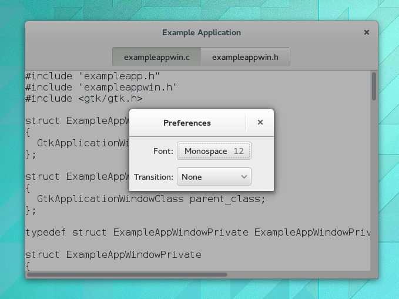

## 一个偏好对话框

一个典型的应用程序应该有一些偏好设置，在每次打开时都能被记住。即使是为这个小范例程序，我们也将想改变正文的字体。


我们将用GSettings 来保存偏好设置，GSettings 需要一个描述我们设置的模式。

```xml
<?xml version="1.0" encoding="UTF-8"?>
<schemalist>
  <schema path="/org/gtk/exampleapp/" id="org.gtk.exampleapp">
    <key name="font" type="s">
      <default>'Monospace 12'</default>
      <summary>Font</summary>
      <description>The font to be used for content.</description>
    </key>
    <key name="transition" type="s">
      <choices>
        <choice value='none'/>
        <choice value='crossfade'/>
        <choice value='slide-left-right'/>
      </choices>
      <default>'none'</default>
      <summary>Transition</summary>
      <description>The transition to use when switching tabs.</description>
    </key>
  </schema>
</schemalist>
```
当我们在应用程序中使用这个模式之前，我们需要从GSettings 中将这编译进二进制文件。GIO 提供`macros`来在工程中做这件事。

接着，我们需要连接settings 和我们的目标部件。一个简便的方法是用GSettings bind 函数绑定设定关键词和目标属性，就像我们这里为转换设置做的。

```c
...

static void
example_app_window_init (ExampleAppWindow *win)
{
  ExampleAppWindowPrivate *priv;

  priv = example_app_window_get_instance_private (win);
  gtk_widget_init_template (GTK_WIDGET (win));
  priv->settings = g_settings_new ("org.gtk.exampleapp");

  g_settings_bind (priv->settings, "transition",
                   priv->stack, "transition-type",
                   G_SETTINGS_BIND_DEFAULT);
}

...
```
([full source](https://git.gnome.org/browse/gtk+/tree/examples/application5/exampleappwin.c))

这个连接字体设置的代码有点儿复杂，因为我们没有对应的简单的目标属性，我们本没打算这么做。

至此，如果我们改变一个设置，程序将会有反应，比如用gsettings 命令行工具。当然，我们希望应用程序提供一个偏好对话框。所以干吧，我们的偏好对话框是GtkDialog 的子类，我们将使用我们已经用过的技术：templates,private structs, settingbindings。

让我们从模板开始。

```xml
<?xml version="1.0" encoding="UTF-8"?>
<interface>
  <!-- interface-requires gtk+ 3.8 -->
  <template class="ExampleAppPrefs" parent="GtkDialog">
    <property name="title" translatable="yes">Preferences</property>
    <property name="resizable">False</property>
    <property name="modal">True</property>
    <child internal-child="vbox">
      <object class="GtkBox" id="vbox">
        <child>
          <object class="GtkGrid" id="grid">
            <property name="visible">True</property>
            <property name="margin">6</property>
            <property name="row-spacing">12</property>
            <property name="column-spacing">6</property>
            <child>
              <object class="GtkLabel" id="fontlabel">
                <property name="visible">True</property>
                <property name="label">_Font:</property>
                <property name="use-underline">True</property>
                <property name="mnemonic-widget">font</property>
                <property name="xalign">1</property>
              </object>
              <packing>
                <property name="left-attach">0</property>
                <property name="top-attach">0</property>
              </packing>
            </child>
            <child>
              <object class="GtkFontButton" id="font">
                <property name="visible">True</property>
              </object>
              <packing>
                <property name="left-attach">1</property>
                <property name="top-attach">0</property>
              </packing>
            </child>
            <child>
              <object class="GtkLabel" id="transitionlabel">
                <property name="visible">True</property>
                <property name="label">_Transition:</property>
                <property name="use-underline">True</property>
                <property name="mnemonic-widget">transition</property>
                <property name="xalign">1</property>
              </object>
              <packing>
                <property name="left-attach">0</property>
                <property name="top-attach">1</property>
              </packing>
            </child>
            <child>
              <object class="GtkComboBoxText" id="transition">
                <property name="visible">True</property>
                <items>
                  <item translatable="yes" id="none">None</item>
                  <item translatable="yes" id="crossfade">Fade</item>
                  <item translatable="yes" id="slide-left-right">Slide</item>
                </items>
              </object>
              <packing>
                <property name="left-attach">1</property>
                <property name="top-attach">1</property>
              </packing>
            </child>
          </object>
        </child>
      </object>
    </child>
  </template>
</interface>
```

接下来是对话框子类。

```c
#include <gtk/gtk.h>

#include "exampleapp.h"
#include "exampleappwin.h"
#include "exampleappprefs.h"

struct _ExampleAppPrefs
{
  GtkDialog parent;
};

struct _ExampleAppPrefsClass
{
  GtkDialogClass parent_class;
};

typedef struct _ExampleAppPrefsPrivate ExampleAppPrefsPrivate;

struct _ExampleAppPrefsPrivate
{
  GSettings *settings;
  GtkWidget *font;
  GtkWidget *transition;
};

G_DEFINE_TYPE_WITH_PRIVATE(ExampleAppPrefs, example_app_prefs, GTK_TYPE_DIALOG)

static void
example_app_prefs_init (ExampleAppPrefs *prefs)
{
  ExampleAppPrefsPrivate *priv;

  priv = example_app_prefs_get_instance_private (prefs);
  gtk_widget_init_template (GTK_WIDGET (prefs));
  priv->settings = g_settings_new ("org.gtk.exampleapp");

  g_settings_bind (priv->settings, "font",
                   priv->font, "font",
                   G_SETTINGS_BIND_DEFAULT);
  g_settings_bind (priv->settings, "transition",
                   priv->transition, "active-id",
                   G_SETTINGS_BIND_DEFAULT);
}

static void
example_app_prefs_dispose (GObject *object)
{
  ExampleAppPrefsPrivate *priv;

  priv = example_app_prefs_get_instance_private (EXAMPLE_APP_PREFS (object));
  g_clear_object (&priv->settings);

  G_OBJECT_CLASS (example_app_prefs_parent_class)->dispose (object);
}

static void
example_app_prefs_class_init (ExampleAppPrefsClass *class)
{
  G_OBJECT_CLASS (class)->dispose = example_app_prefs_dispose;

  gtk_widget_class_set_template_from_resource (GTK_WIDGET_CLASS (class),
                                               "/org/gtk/exampleapp/prefs.ui");
  gtk_widget_class_bind_template_child_private (GTK_WIDGET_CLASS (class), ExampleAppPrefs, font);
  gtk_widget_class_bind_template_child_private (GTK_WIDGET_CLASS (class), ExampleAppPrefs, transition);
}

ExampleAppPrefs *
example_app_prefs_new (ExampleAppWindow *win)
{
  return g_object_new (EXAMPLE_APP_PREFS_TYPE, "transient-for", win, "use-header-bar", TRUE, NULL);
}

```
现在我们再看`preferences_activated()`函数，使它打开一个偏好对话框。

```c
...

static void
preferences_activated (GSimpleAction *action,
                       GVariant      *parameter,
                       gpointer       app)
{
  ExampleAppPrefs *prefs;
  GtkWindow *win;

  win = gtk_application_get_active_window (GTK_APPLICATION (app));
  prefs = example_app_prefs_new (EXAMPLE_APP_WINDOW (win));
  gtk_window_present (GTK_WINDOW (prefs));
}

...
```
([full source](https://git.gnome.org/browse/gtk+/tree/examples/application6/exampleapp.c))

完成所有这些工作后，我们的应用程序现在可以像这样显示一个偏好对话框：



