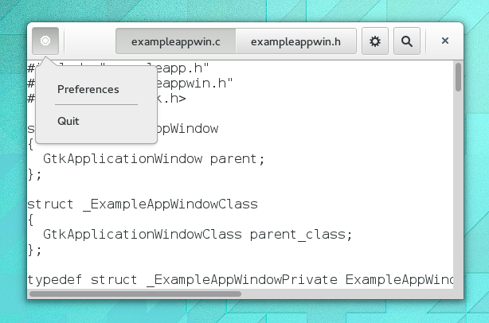

## 标题栏

我们的应用程序已经用了`GtkHeaderBar`，但至今它仍然只在顶端显示一个‘正常’的window titlebar。这有点多余，我们现在要用header bar 来替代titlebar。为了达到目的，我们将header bar移到窗口的直接子成员中，并把它设为titlebar。

```xml
<?xml version="1.0" encoding="UTF-8"?>
<interface>
  <!-- interface-requires gtk+ 3.8 -->
  <template class="ExampleAppWindow" parent="GtkApplicationWindow">
    <property name="title" translatable="yes">Example Application</property>
    <property name="default-width">600</property>
    <property name="default-height">400</property>
        <child type="titlebar">
          <object class="GtkHeaderBar" id="header">
            <property name="visible">True</property>
            <property name="show-close-button">True</property>
            <child>
              <object class="GtkLabel" id="lines_label">
                <property name="visible">False</property>
                <property name="label" translatable="yes">Lines:</property>
              </object>
              <packing>
                <property name="pack-type">start</property>
              </packing>
            </child>
            <child>
              <object class="GtkLabel" id="lines">
                <property name="visible">False</property>
              </object>
              <packing>
                <property name="pack-type">start</property>
              </packing>
            </child>
            <child type="title">
              <object class="GtkStackSwitcher" id="tabs">
                <property name="visible">True</property>
                <property name="margin">6</property>
                <property name="stack">stack</property>
              </object>
            </child>
            <child>
              <object class="GtkToggleButton" id="search">
                <property name="visible">True</property>
                <property name="sensitive">False</property>
                <style>
                  <class name="image-button"/>
                </style>
                <child>
                  <object class="GtkImage" id="search-icon">
                    <property name="visible">True</property>
                    <property name="icon-name">edit-find-symbolic</property>
                    <property name="icon-size">1</property>
                  </object>
                </child>
              </object>
              <packing>
                <property name="pack-type">end</property>
              </packing>
            </child>
            <child>
              <object class="GtkMenuButton" id="gears">
                <property name="visible">True</property>
                <property name="direction">none</property>
                <property name="use-popover">True</property>
                <style>
                  <class name="image-button"/>
                </style>
              </object>
              <packing>
                <property name="pack-type">end</property>
              </packing>
            </child>
          </object>
        </child>
    <child>
      <object class="GtkBox" id="content_box">
        <property name="visible">True</property>
        <property name="orientation">vertical</property>
        <child>
          <object class="GtkSearchBar" id="searchbar">
            <property name="visible">True</property>
            <child>
              <object class="GtkSearchEntry" id="searchentry">
                <signal name="search-changed" handler="search_text_changed"/>
                <property name="visible">True</property>
              </object>
            </child>
          </object>
        </child>
        <child>
          <object class="GtkBox" id="hbox">
            <property name="visible">True</property>
            <child>
              <object class="GtkRevealer" id="sidebar">
                <property name="visible">True</property>
                <property name="transition-type">slide-right</property>
                <child>
                 <object class="GtkScrolledWindow" id="sidebar-sw">
                   <property name="visible">True</property>
                   <property name="hscrollbar-policy">never</property>
                   <property name="vscrollbar-policy">automatic</property>
                   <child>
                     <object class="GtkListBox" id="words">
                       <property name="visible">True</property>
                       <property name="selection-mode">none</property>
                     </object>
                   </child>
                 </object>
                </child>
              </object>
            </child>
            <child>
              <object class="GtkStack" id="stack">
                <signal name="notify::visible-child" handler="visible_child_changed"/>
                <property name="visible">True</property>
              </object>
            </child>
          </object>
        </child>
      </object>
    </child>
  </template>
</interface>
```
使用header bar的一个额外的好处是我们免费得到了一个回退项。如果这回退应用了，我们的应用程序将如下显示。



如果我们为窗口设定了图标，那么菜单按钮就是设定好的图标，而不是你现在看到的样子。

