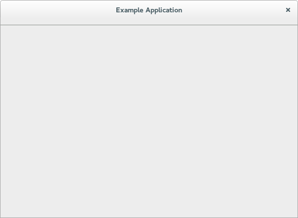

## 填充窗口

在这节中，我们用GtkBuilder 模板结合一个GtkBuilder ui 文件和我们的应用程序窗口类。

我们简单的ui 文件把GtkHeaderBar 放在GtkStack 部件顶端。头栏包括一个显示GtkStack 页面分页的一行的独立部件——GtkStackSwitcher。

```xml
<?xml version="1.0" encoding="UTF-8"?>
<interface>
  <!-- interface-requires gtk+ 3.8 -->
  <template class="ExampleAppWindow" parent="GtkApplicationWindow">
    <property name="title" translatable="yes">Example Application</property>
    <property name="default-width">600</property>
    <property name="default-height">400</property>
    <child>
      <object class="GtkBox" id="content_box">
        <property name="visible">True</property>
        <property name="orientation">vertical</property>
        <child>
          <object class="GtkHeaderBar" id="header">
            <property name="visible">True</property>
            <child type="title">
              <object class="GtkStackSwitcher" id="tabs">
                <property name="visible">True</property>
                <property name="margin">6</property>
                <property name="stack">stack</property>
              </object>
            </child>
          </object>
        </child>
        <child>
          <object class="GtkStack" id="stack">
            <property name="visible">True</property>
          </object>
        </child>
      </object>
    </child>
  </template>
</interface>
```
为了在我们的应用程序中使用这个文件，我们回到我们的GtkApplicationWindow 子类，从类初始化函数中调用gtk_widget_class_set_template_from_resource() 来把ui 文件设为这个类的模板。在实例初始化函数中我们增加gtk_widget_init_template() 去为我们的类的个体实例化模板。

```
 ...

static void
example_app_window_init (ExampleAppWindow *win)
{
  gtk_widget_init_template (GTK_WIDGET (win));
}

static void
example_app_window_class_init (ExampleAppWindowClass *class)
{
  gtk_widget_class_set_template_from_resource (GTK_WIDGET_CLASS (class),
                                               "/org/gtk/exampleapp/window.ui");
}

 ...

 ```

([full source](https://git.gnome.org/browse/gtk+/tree/examples/application2/exampleappwin.c))

你也许注意到了，我们在函数中用了变量_from_resource()来设定一个模板。现在我们需要用GLib的资源功能在二进制文件中包含一个ui file。通常是在.gresource.xml中列出所有资源，就像这样：

```xml
<?xml version="1.0" encoding="UTF-8"?>
<gresources>
  <gresource prefix="/org/gtk/exampleapp">
    <file preprocess="xml-stripblanks">window.ui</file>
  </gresource>
</gresources>
```

这个文件必须被转换成一个C 源文件，这样它才能和其他源文件一起被编译链接进应用程序中。因此，我们使用了`glib-complie-resources`：

```
glib-compile-resources exampleapp.gresource.xml --target=resources.c --generate-source
```

如今我们的应用程序就像这样：


