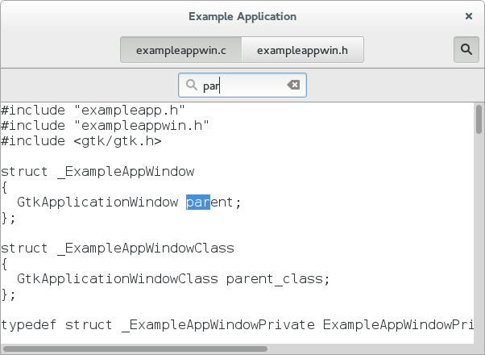

## 增加搜索条

我们继续充实我们应用程序的功能。如今，我们添加搜索。GTK+在`GtkSearchEntry`和`Gtksearchbar`中支持这个功能。搜索条是一个可以嵌入顶端来展现搜索输入。

我们在头栏增加一个开关按钮，他可以用来滑出头栏下的搜索条。

```xml
<?xml version="1.0" encoding="UTF-8"?>
<interface>
  <!-- interface-requires gtk+ 3.8 -->
  <template class="ExampleAppWindow" parent="GtkApplicationWindow">
    <property name="title" translatable="yes">Example Application</property>
    <property name="default-width">600</property>
    <property name="default-height">400</property>
    <child>
      <object class="GtkBox" id="content_box">
        <property name="visible">True</property>
        <property name="orientation">vertical</property>
        <child>
          <object class="GtkHeaderBar" id="header">
            <property name="visible">True</property>
            <child type="title">
              <object class="GtkStackSwitcher" id="tabs">
                <property name="visible">True</property>
                <property name="margin">6</property>
                <property name="stack">stack</property>
              </object>
            </child>
            <child>
              <object class="GtkToggleButton" id="search">
                <property name="visible">True</property>
                <property name="sensitive">False</property>
                <style>
                  <class name="image-button"/>
                </style>
                <child>
                  <object class="GtkImage" id="search-icon">
                    <property name="visible">True</property>
                    <property name="icon-name">edit-find-symbolic</property>
                    <property name="icon-size">1</property>
                  </object>
                </child>
              </object>
              <packing>
                <property name="pack-type">end</property>
              </packing>
            </child>
          </object>
        </child>
        <child>
          <object class="GtkSearchBar" id="searchbar">
            <property name="visible">True</property>
            <child>
              <object class="GtkSearchEntry" id="searchentry">
                <signal name="search-changed" handler="search_text_changed"/>
                <property name="visible">True</property>
              </object>
            </child>
          </object>
        </child>
        <child>
          <object class="GtkStack" id="stack">
            <signal name="notify::visible-child" handler="visible_child_changed"/>
            <property name="visible">True</property>
          </object>
        </child>
      </object>
    </child>
  </template>
</interface>
```
实现搜索条需要更改一点我们还没打算完成的代码。搜索实现的核心是一个监听搜索条文字变化的信号句柄。

```c
...

static void
search_text_changed (GtkEntry         *entry,
                     ExampleAppWindow *win)
{
  ExampleAppWindowPrivate *priv;
  const gchar *text;
  GtkWidget *tab;
  GtkWidget *view;
  GtkTextBuffer *buffer;
  GtkTextIter start, match_start, match_end;

  text = gtk_entry_get_text (entry);

  if (text[0] == '\0')
    return;

  priv = example_app_window_get_instance_private (win);

  tab = gtk_stack_get_visible_child (GTK_STACK (priv->stack));
  view = gtk_bin_get_child (GTK_BIN (tab));
  buffer = gtk_text_view_get_buffer (GTK_TEXT_VIEW (view));

  /* Very simple-minded search implementation */
  gtk_text_buffer_get_start_iter (buffer, &start);
  if (gtk_text_iter_forward_search (&start, text, GTK_TEXT_SEARCH_CASE_INSENSITIVE,
                                    &match_start, &match_end, NULL))
    {
      gtk_text_buffer_select_range (buffer, &match_start, &match_end);
      gtk_text_view_scroll_to_iter (GTK_TEXT_VIEW (view), &match_start,
                                    0.0, FALSE, 0.0, 0.0);
    }
}

static void
example_app_window_init (ExampleAppWindow *win)
{

...

  gtk_widget_class_bind_template_callback (GTK_WIDGET_CLASS (class), search_text_changed);

...

}

...
```

([full source](https://git.gnome.org/browse/gtk+/tree/examples/application7/exampleappwin.c))

加上了搜索条，我们的应用程序现在是这样的：


